# To configure virtual machines or cloud instances with different network configurations (e.g., subnets, VPCs, security groups) and analyze network traffic

**Virtual Machines** are work stations (representing a physical computer) running an operating system and applications just like physical laptops and computers. They are created by a virtualization software called Hypervisor, which is the software layer responsible for creating and managing VMs on physical hardware, it abstracts physical resources (such as CPU, Memory, Storage and Network) and allocates them to virtual machines (VMs).

**Cloud Instances** also known as virtual instances or VMs for computing resources provided by cloud service providers (AWS or Google Cloud) that run on virtualized hardware infrastructure. Cloud instances allow you to deploy and manage virtualized computing environments in the cloud without the need to invest in physical hardware.

### Benefits of Virtual Machine
* Resource Utilization: it's enable better utilization of physical hardware by running multiple VM's on a single physical server.
* Flexibility and Portability: VMs can be easily migrated between different physical hosts, allowing workload balancing, disaster recovery and infrastructure maintenance without downtime
* Scalability: They can be very quick to provisioned and scaled up or down based on demand, providing agility and flexibilty in responding to changing workload requirements.

### Prerequisites
Things I need to provision a VMs and cloud instances successfully:

1. Sign up for an [AWS account](https://aws.amazon.com) (free tier)
2. Install [Terraform](https://www.terraform.io/downloads.html) on your local machine (Laptop or Desktop). 
3. Install [AWS command line interface (CLI)](https://docs.aws.amazon.com/cli/latest/userguide/getting-started-install.html) and configure on your local machine
4. Install code editor ([Visual Studio Code](https://code.visualstudio.com/))

## Step 1: Setup Your Environment and Initialize Terraform
> Configure your AWS user account for Access key and Secret Access key to login to your AWS account through the terminal or from your terraform manifest file.


> Create a file named provider.tf in your project folder to hold all terraform/aws configurations to run our infrastructure. Open your project folder in your code editor.

```markdown
terraform {
    required_version = "~> 1.8"
  required_providers {
    aws = {
        source = "hashicorp/aws"
        version = "~> 3.0"

    }
    
  }
}

provider "aws" {
  region = us-east-1
}

# Credentials are configured on PC terminal or command prompt using "aws configure"
```
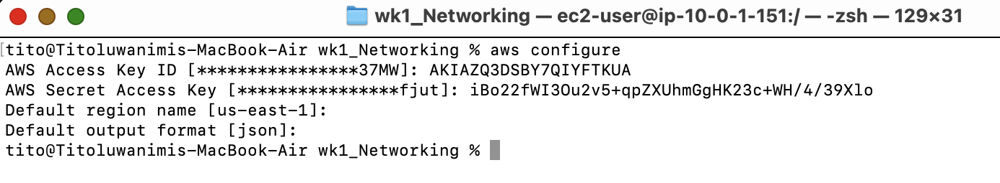

> Open a command prompt and navigate to your project directory.
> Run the following command to initialize Terraform:

`terraform init`

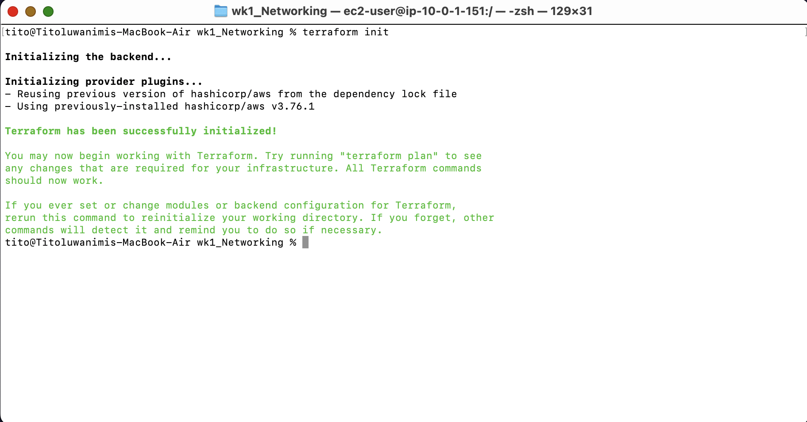
This command will download the necessary terraform provider plugins and other terraform working directory


## Step 2: Create Networking Infrastructure

In order to have our application accessible on the cloud, we will be creating some networking configuration that enables communication and enhance security of our applications, such as VPC, Subnets, Security Group, Internet Gateway and Route Tables.

Create a file - `networking.tf`

* Create a VPC named `net_vpc` with CIDR block "10.0.0.0/16"

```markdown
resource "aws_vpc" "net_vpc" {
  cidr_block = "10.0.0.0/16"

  enable_dns_hostnames = true


  tags = {
    Name = "Networking VPC"
  }
}
```

* Create Public Subnet within your VPC

> A subnet is a range of IP addresses in your VPC (Virtual Private Cloud) that allows you to organize and manage your resources effectively. Each subnet resides within an AZ (Availability Zone) and they can contain multiple resources like, EC2 instances and RDS databases.

> Subnets are classified as public or private based on their routing configuration.

> Public Subnet have a route to the internet via Internet Gateway or NAT Gateway and they hold resources that need direct internet access.

> Private Subnet do not have a route to the internet and are isolated from the public internet. They are commonly used for backend databases.

```markdown
# Create public subnet
resource "aws_subnet" "public_sub" {
  vpc_id     = aws_vpc.net_vpc.id
  cidr_block = "10.0.1.0/24"
  map_public_ip_on_launch = true
  availability_zone = "us-east-1a"
  

  tags = {
    Name = "Public_subnet"
  }
}
```

`vpc_id` this set where the subnet should be created, using our created vpc ID - `nat_vpc` resource.

availability_zone sets the location for our subnet in our current AWS region.

`map_public_ip_on_lunch = true` automatically assigns a public IP address to instances launched in our public subnet.

* Create Internet Gateway (IGW) and associate with our VPC `nat_vpc`. This allows communication between our VPC and the internet.

```markdown
# Create an IGW
resource "aws_internet_gateway" "gw" {
  vpc_id = aws_vpc.net_vpc.id

  tags = {
    Name = "vpc-igw"
  }
}
```

* Create a Route Table and Associate with VPC `nat_vpc`.
> Subnet is associated with a route table, which defines the rules for routing traffic within the subnet and to external destinations. Route tables specify how traffic should be routed based on the destination IP address, gateway, or network interface.

```markdown
# Create Route Table
resource "aws_route_table" "nat_route_public" {
  vpc_id = aws_vpc.net_vpc.id

  route {
    cidr_block = "0.0.0.0/0"
    gateway_id = aws_internet_gateway.gw.id
  }

  tags = {
    Name = "Public Route Table"
  }
}
```
The Route Table has a route of `cidr_block = "0.0.0.0/0"` which sends all traffic to IGW

* Create a Route Table Association with the Public Subnet, to allow resources in the public subnet to access the internet. 
> By default all subnets are private but when they are allowed to access internet they become public

```markdown
# Associate public subnets with the public route table
resource "aws_route_table_association" "nat_public" {
  subnet_id      = aws_subnet.public_sub.id
  route_table_id = aws_route_table.nat_route_public.id
}
```

* Create an EC2 key Pair to allow you SSH into your instance and download it into your project folder.
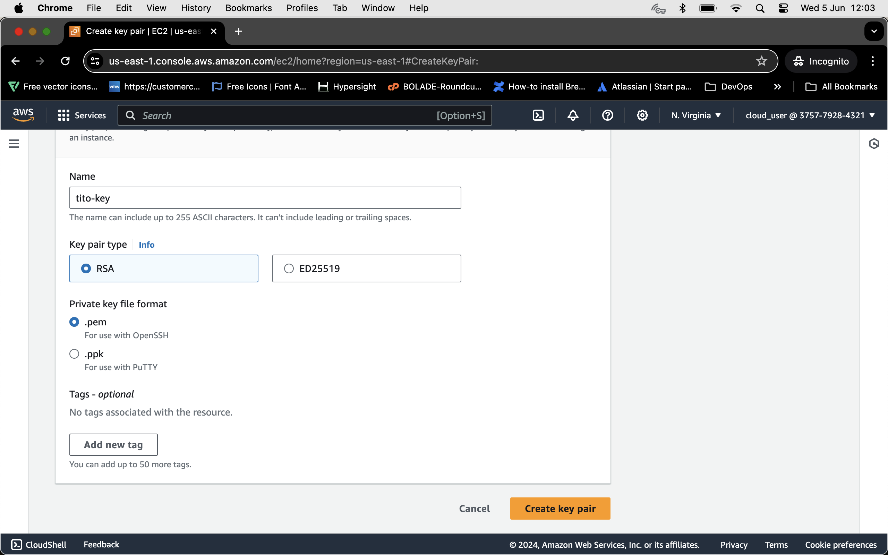


* Create `Variable.tf` file, this help us declare some variables that we can easily reuse by referencing them with name of the variable `var.name`

```markdown
# Create AWS region variable
variable "region" {
  description = "Region to create our Resources"
  type = string
  default = "us-east-1"
}

# Create EC2 Instance Type
variable "instance_type" {
  description = "EC2 Instance Type"
  type = string
  default = "t2.micro"
}

# AWS EC2 Instance Key Pair
variable "instance_keypair" {
  description = "AWS EC2 Key Pair that need to be associated with EC2 Instance"
  type = string
  default = "tito-key"
}
```

* Create a `Datasource.tf` file for your instance required system functionalities using the most recent AMI in your Instance AMI template

```markdown
# EC2 instance AMI
data "aws_ami" "amzlinux2" {
  most_recent      = true
  owners           = ["amazon"]

  filter {
    name   = "name"
    values = ["al2023-ami-*"]
  }

  filter {
    name   = "root-device-type"
    values = ["ebs"]
  }

  filter {
    name   = "virtualization-type"
    values = ["hvm"]
  }

  filter {
    name   = "architecture"
    values = ["x86_64"]
  }
}
```


* Create EC2 Instance file `ec2_instance.tf` to be placed in our VPC

```markdown
resource "aws_instance" "ec2vm" {
  ami           = data.aws_ami.amzlinux2.id
  vpc_security_group_ids = [
    aws_security_group.vpc_sh.id,
    aws_security_group.nat_web.id
  ]

  instance_type = var.instance_type
  
  subnet_id = aws_subnet.public_sub.id

  key_name = var.instance_keypair

  tags = {
    Name = "My EC2"
  }
}
```

* Create a Security Group file `security_group.tf` that acts as firewall and determines the allowed traffic into their associated resources or VPC. And SSH security group that allow on port 22.

```markdown
# Security Group for SSH and Web traffic
resource "aws_security_group" "nat_web" {
  # ... other configuration ...
  name = "vpc_web"
  vpc_id = aws_vpc.net_vpc.id

  tags = {
    Name = "VPC_WEB"
  }

  ingress {
    description = "Allow Port 443"
    protocol  = "tcp"
    cidr_blocks = [ "0.0.0.0/0" ]
    from_port = 443
    to_port   = 443
  }

  ingress {
    description = "Allow Port 80"
    protocol  = "tcp"
    cidr_blocks = [ "0.0.0.0/0" ]
    from_port = 80
    to_port   = 80
  }

    ingress {
    description = "Allow ICMP"
    cidr_blocks = [ "0.0.0.0/0" ]
    from_port = -1
    protocol = "icmp"
    to_port = -1
  }

  egress {
    description = "Allow all IP and Ports Outbound"
    from_port        = 0
    to_port          = 0
    protocol         = "-1"
    cidr_blocks      = ["0.0.0.0/0"]
  }
}

# Create SSH SG
resource "aws_security_group" "vpc_sh" {
  name        = "vpc_ssh"
  description = "Dev VPC SSH"
  vpc_id = aws_vpc.net_vpc.id

  tags = {
    Name = "VPC_SSH"
  }

  ingress {
    description = "Allow Port 22"
    protocol  = "tcp"
    cidr_blocks = ["0.0.0.0/0"]
    from_port = 22
    to_port   = 22
  }

  egress {
    description = "Allow all IP and Ports outbound"
    from_port   = 0
    to_port     = 0
    protocol    = "-1"
    cidr_blocks = ["0.0.0.0/0"]
  }
}
```

* Create an `output.tf` file to give us values for our Instance IP Address and DNS name in our terminal.

```markdown
# Terraform Output Values

# EC2 Instance Public IP
output "instance_publicip" {
  description = "EC2 Instance Public IP"
  value = aws_instance.ec2vm.public_ip
}


# EC2 Instance Public DNS
output "instance_publicdns" {
  description = "EC2 Instance Public DNS"
  value = aws_instance.ec2vm.public_dns
}
```

## Step 3: Validate, Plan and Apply Terraform Configuration
You should now run the following command to review and execute your planned infrastructure codes and you can see all the resources to be created through your terminal or command prompt.


```markdown
terraform validate
```
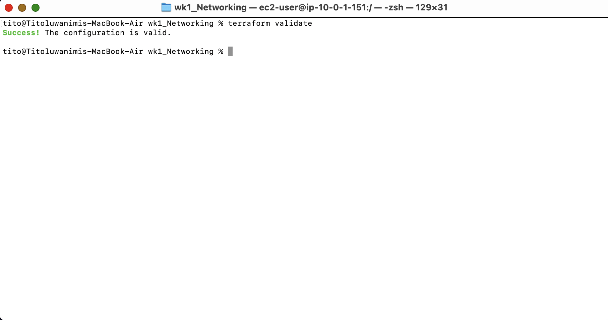

```markdown
terraform plan
```
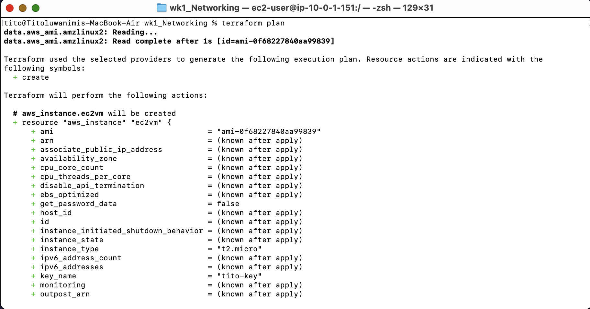

```markdown
terraform apply --auto-approve
```
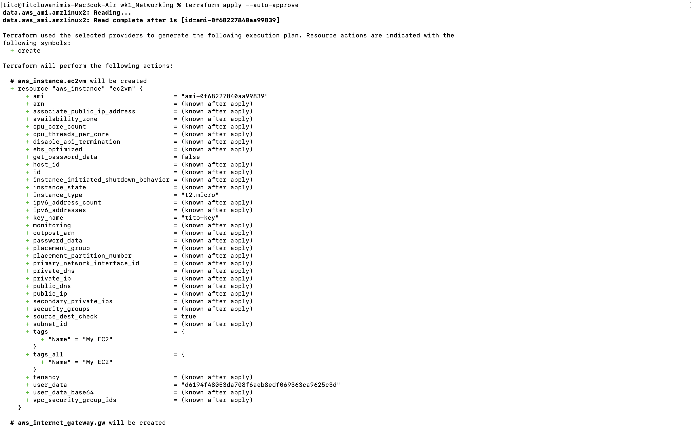

Varify that our VPC was created and EC2 was lunched inside our VPC
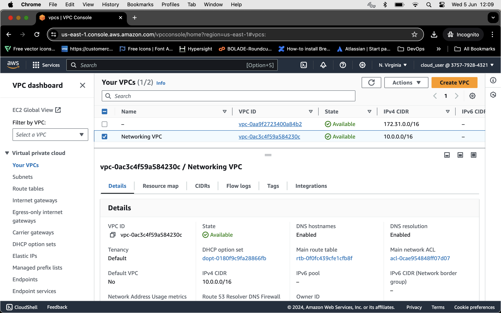

And our lunched EC2 instance
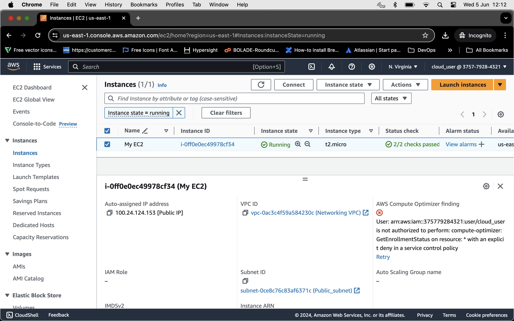

Proof of my EC2 instance running using the auto public IP that was assigned when it was created (54.237.85.227)
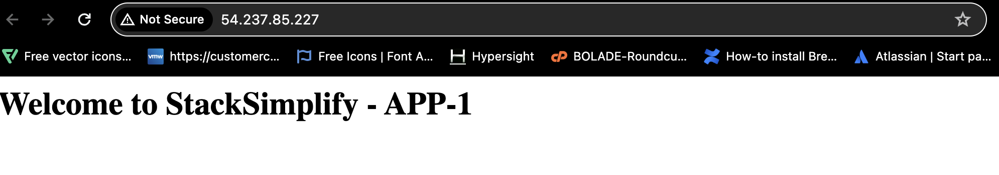

## Test our instance conectivity through PING
Through my terminal using the `PING` command to test if the instance is able to send packets.
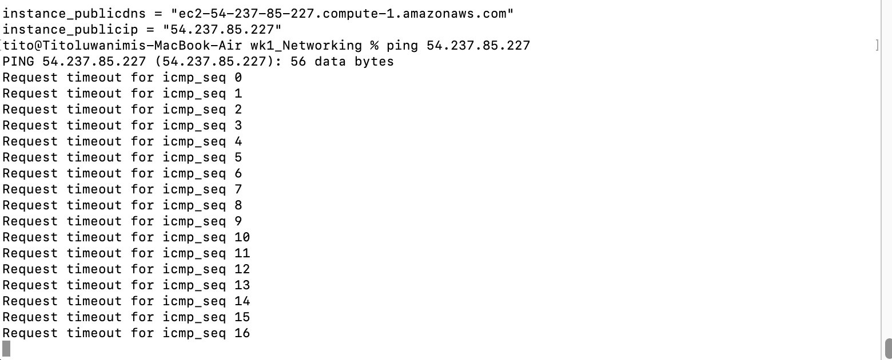

As shown above, it was returning a "Request timeout for icmp_seq" which shown that my security group as not allowed/open for icmp port.
Therefore I went back into my `securitygroup.tf` and added `ingress` rule to allow icmp (then in my terminal run `terraform apply` again to add the new changes). Then I try `PING` command again.
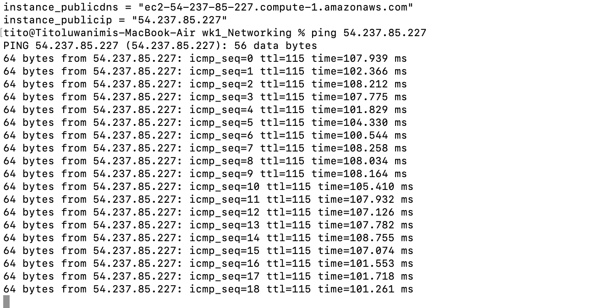


## To Analyze Network Traffic in your Instance by using Packet Capturing Tool (Tcpdump)

You should first `SSH` into your EC2 instance from inside your terminal by navigating to your EC2 instance in your AWS account and go to the `Connect` tab which will give you the `SSH` command needed to use in your terminal
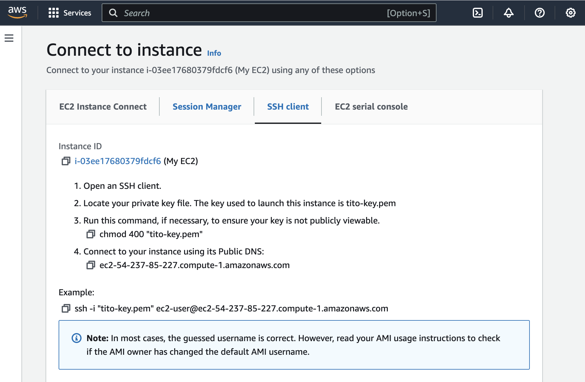

Move to your terminal and follow the instruction as seen in your connect page then SSH into your instance.
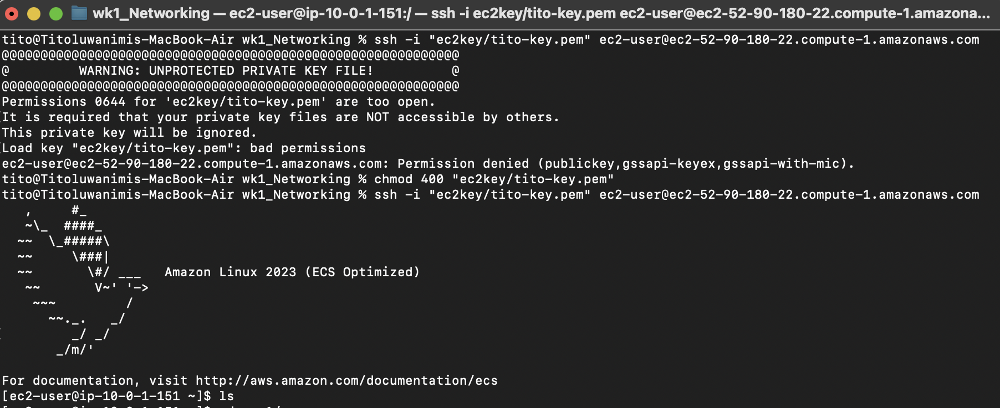

**Install Tcpdump into our EC2 instance**
In your terminal run the `sudo yum install tcpdump` command. After a successful install, then run the `tcpdump -i any` to capture packets from all interfaces if you don't know your EC2 instance interface or `tcpdump -i enX0 -c 10` to capture first 10 packets and exit.
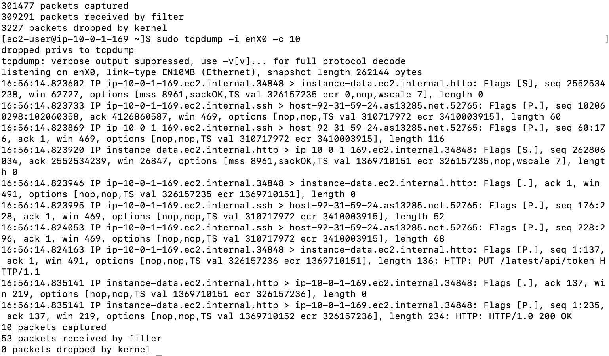


**Titoluwanimi Onifade**


